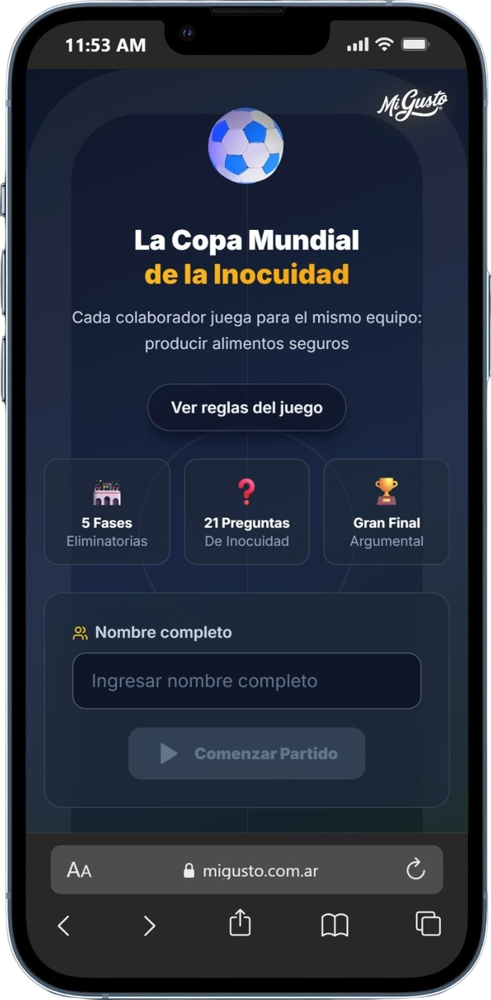
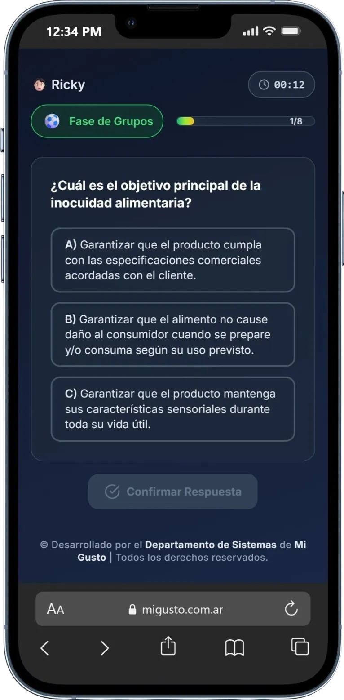
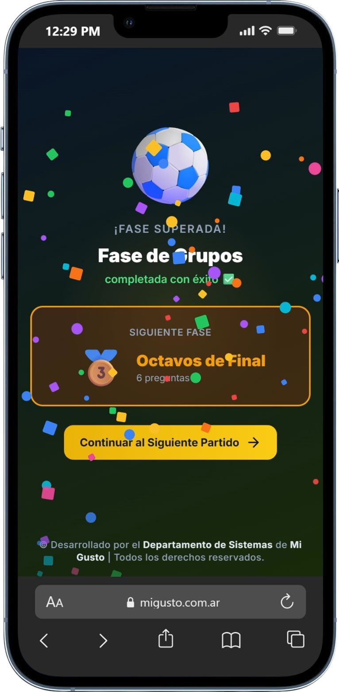
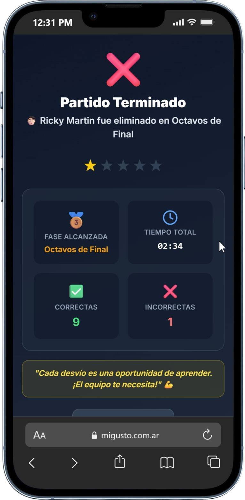

  

  # 🏆 La Copa Mundial de la Inocuidad

  **Plataforma Interactiva de Gamificación y Capacitación en Inocuidad Alimentaria**

  
  
  
  
  
  

  ---

  

    <i>"Cada colaborador juega para el mismo equipo: producir alimentos seguros."</i>
  

 

> [!IMPORTANT]
> **Celebración del Día Mundial de la Inocuidad Alimentaria (7 de Junio)**  
> Desarrollado para fortalecer la cultura de inocuidad, higiene y buenas prácticas de manufactura a través de una experiencia competitiva, didáctica y dinámica.

 

## 📌 Sobre el Proyecto

**La Copa Mundial de la Inocuidad** es una aplicación web gamificada inspirada en el formato de un torneo mundialista de fútbol. Diseñada especialmente para los colaboradores de **Mi Gusto**, transforma el aprendizaje de normativas y estándares de inocuidad alimentaria en un desafío estimulante y entretenido.

Los participantes avanzan a través de distintas fases clasificatorias demostrando sus conocimientos en manipulación de alimentos, control de temperaturas, higiene personal, almacenamiento y desinfección, compitiendo por un lugar de honor en el ranking global.

---

## 📸 Galería de Capturas

  <table border="0" style="width: 100%; border-collapse: collapse;">
    <tr>
      <td width="50%" align="center" style="padding: 8px;">
        
         
        <b>01. Pantalla Principal y Registro de Jugador</b>
      </td>
      <td width="50%" align="center" style="padding: 8px;">
        
         
        <b>02. Módulo de Trivia y Selección de Respuestas</b>
      </td>
    </tr>
    <tr>
      <td width="50%" align="center" style="padding: 8px;">
        
         
        <b>03. Retroalimentación Didáctica y Explicación Técnica</b>
      </td>
      <td width="50%" align="center" style="padding: 8px;">
        
         
        <b>04. Tabla de Posiciones y Pergamino de Honor</b>
      </td>
    </tr>
  </table>

---

## ✨ Características Principales

* ⚽ **Estructura de Torneo Eliminatorio**: 
  El juego se divide en 5 etapas secuenciales: *Fase de Grupos*, *Octavos de Final*, *Cuartos de Final*, *Semifinal* y la *Gran Final Argumental*.
* 🧠 **Retroalimentación Didáctica en Tiempo Real**: 
  Cada respuesta cuenta con explicaciones fundamentadas en normas oficiales de inocuidad alimentaria, garantizando un aprendizaje continuo durante el juego.
* 🔀 **Aleatorización Inteligente**: 
  Las opciones de respuesta se barajan dinámicamente en cada partida para promover la comprensión real en lugar de la memorización posicional.
* ⏱️ **Medición de Tiempo y Precisión**: 
  Ranking basado en velocidad de respuesta y exactitud técnica, registrando tiempos exactos en milisegundos.
* 📊 **Tabla de Posiciones Global (Leaderboard)**: 
  Integración fluida con base de datos remota para registrar las mejores puntuaciones y mostrar a los líderes del torneo en tiempo real.
* 📜 **Pergamino de Campeones**: 
  Reconocimiento digital e interactivo concedido a los jugadores que logran superar la Gran Final con éxito.
* 🎨 **Interfaz de Alto Impacto Visual**: 
  Diseño moderno en modo oscuro con temática deportiva, elementos brillantes, micro-animaciones fluidas e íconos interactivos.

---

## 🛠️ Tecnologías Destacadas

* **Frontend**: [React 18](https://reactjs.org/) + [TypeScript](https://www.typescriptlang.org/)
* **Bundler & Tooling**: [Vite](https://vitejs.dev/)
* **Estilos & Diseño**: [Tailwind CSS](https://tailwindcss.com/)
* **Animaciones Interactivas**: [Framer Motion](https://www.framer.com/motion/)
* **Iconografía**: [Lucide React](https://lucide.dev/)
* **Persistencia & Backend**: [Supabase](https://supabase.com/)

---

  Desarrollado con pasión por el <b>Departamento de Sistemas</b> de <b>Mi Gusto</b>  
   
  © Todos los derechos reservados.

